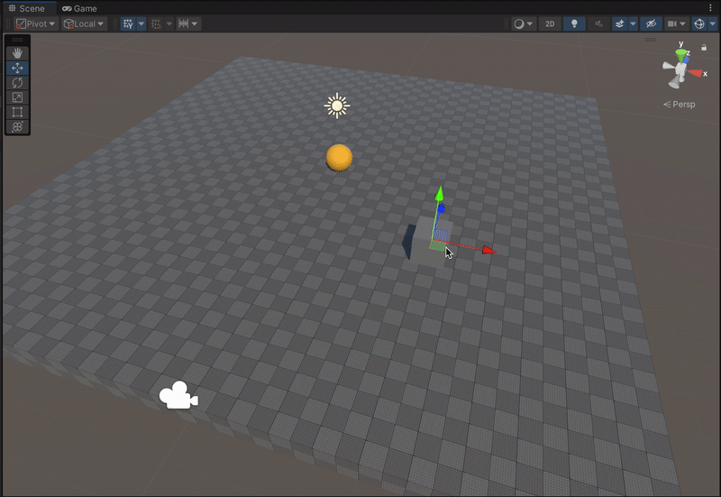

# Attracting bodies to an entity

Interacting with Physics Bodies can be done using scripts. For example to alter velocity of a body, you can query for its `PhysicsVelocity` and set new values as you want. Let's make an example that attracts all bodies to a single point.

First, we will create a `MonoBehaviour` script file called `TargetAuthoring.cs` (with two values, one float and one GameObject) and attach it to the Sphere GameObject. This will allow us to input data values from the inspector. Then, we need to add an `IComponentData` struct named `Target` and as well as a `Baker` called `TargetAuthoringBaker` and bridge the values from the `TargetAuthoring` with the `Target`. 

```csharp
using Unity.Entities;
using UnityEngine;

public struct Target : IComponentData
{
    public Entity TargetEntity;
    public float MaxDistance;
}

public class TargetAuthoring : MonoBehaviour
{
    public GameObject TargetPrefab;
    public float MaxDistance;
}

public class TargetAuthoringBaker : Baker<TargetAuthoring>
{
    public override void Bake(TargetAuthoring authoring)
    {
        var component = new Target
        {
            MaxDistance = authoring.MaxDistance,
            TargetEntity = GetEntity(authoring.TargetPrefab)
        };
        AddComponent(component);
    }
}
```
>**Pre-requisite:** The examples provided in this section assume that you have previously created a scene as per the instructions provided in the [Simulation set up](concepts-simulation-set-up.md) section.

Now, we need do something similar to be able run the logic inside the `ISystem`. Create another `MonoBehaviour` script file called `MovingBodyAuthoring.cs` but instead of authoring the same values than before, we will use a float for velocity magnitude.

Inside the OnUpdate within `ISystem`, let's use the new idiomatic `foreach()` to query for all the entities with `MovingBody`. Then we can run the command to calculate the relative distance between the `Target` position and the `MovingBody` entity. Finally, we compare if the distance is smaller than the MaxDistance value, if so the `PhysicsVelocity` will be altered and the entity will start moving towards the target position. 

```csharp
using Unity.Entities;
using Unity.Mathematics;
using Unity.Physics;
using Unity.Transforms;
using UnityEngine;

public struct MovingBody : IComponentData
{
    public float Velocity;
}

public class MovingBodyAuthoring : MonoBehaviour
{
    public float Velocity;
}

class MovingBodyAuthoringBaker : Baker<MovingBodyAuthoring>
{
    public override void Bake(MovingBodyAuthoring authoring)
    {
        var component = new MovingBody
        {
            Velocity = authoring.Velocity
        };
        AddComponent(component);
    }
}

public partial struct MovingBodySystem : ISystem
{
    public void OnCreate(ref SystemState state) {}

    public void OnDestroy(ref SystemState state) {}

    public void OnUpdate(ref SystemState state)
    {
        foreach (var(target, transform, moving, velocity) in SystemAPI.Query<RefRO<Target>, RefRO<LocalTransform>, RefRW<MovingBody>, RefRW<PhysicsVelocity>>().WithAll<MovingBody>())
        {
            var targetPosition = SystemAPI.GetComponent<LocalTransform>(target.ValueRO.TargetEntity).Position;
            var direction = math.normalize(targetPosition - transform.ValueRO.Position);

            if (math.distance(targetPosition, transform.ValueRO.Position) < target.ValueRO.MaxDistance)
                velocity.ValueRW.Linear = moving.ValueRO.Velocity * direction;
            else
                velocity.ValueRW.Linear = new float3(0, 0, 0);
        }
    }
}
```

>**Note:** it's not necessary to iterate over all the bodies to get a subset to be affected, but for simplicity it is shown like this for now.


You can alter the velocity as you want. If you want the bodies to go directly to the `Target` position above, you can just set `velocity.ValueRW.Linear` to be exactly the difference in position. That would get the body there in 1 second, assuming it does not hit anything or is not affected by gravity while en route. If you want to get there in one step, you also need to know the physics delta time step using `Time.fixedDeltaTime`, and divide the linear velocity by that.

Note that the above example is not setting the position directly, but is just altering velocity to get the body to where you want it to be. That way it can still interact with all other objects in the scene correctly, rather than just teleporting to a given position and hoping for the best.

Scene set-up:
1. Create the two different script files called `TargetAuthoring.cs` and `MovingBodyAuthoring.cs`.
2. Attach the two scripts files to the Sphere GameObject.
3. Set Velocity value to 1, and MaxDistance to 5.
4. Create a Cube GameObject and rename it Target.
5. Select the Sphere GameObject and drag and drop the Target GameObject into the GameObject input field within the TargetAuthoring in the inspector window.
6. Enter Play mode and see what happens.

>

### How it should actually be done with DOTS

The most efficient way to get all the bodies close to that point is to either use the `Unity.Physics.CollisionWorld.OverlapAabb` method or, for more accuracy, `CalculateDistance` (with its `MaxDistance` set to the `maxDistance` defined in the above example). For more information, see the [Collision queries](collision-queries.md) section.

## Impulses

Now you have seen how to alter velocity in code, but it can be tricky to work out what velocity values to set in order to get a desired outcome. A common thing to do is to apply an impulse at a given point on the body and have it react. An example: shooting the object with a gun.

Unity Physics provides a few `Unity.Physics.Extensions.ComponentExtensions` methods to do the math for you, for example `ApplyImpulse()`. Here's its current implementation:

```csharp
public static void ApplyImpulse(ref PhysicsVelocity pv, PhysicsMass pm,
    Translation t, Rotation r, float3 impulse, float3 point)
    {
        // Linear
        pv.Linear += impulse;

        // Angular
        {
            // Calculate point impulse
            var worldFromEntity = new RigidTransform(r.Value, t.Value);
            var worldFromMotion = math.mul(worldFromEntity, pm.Transform);
            float3 angularImpulseWorldSpace = 
                math.cross(point - worldFromMotion.pos, impulse);
            float3 angularImpulseInertiaSpace = 
                math.rotate(math.inverse(worldFromMotion.rot), angularImpulseWorldSpace);

            pv.Angular += angularImpulseInertiaSpace * pm.InverseInertia;
        }
    }
```
Favour the form of calls that take the raw Component Data (such as `PhysicsVelocity`) rather than ones that query for them. Do this to encourage the code to be more efficient and work over arrays of the data in the efficient ECS style.
> **Note:** More methods will be provided over time, but they will all work off the same `PhysicsVelocity` and `PhysicsMass` components you have today, so feel free to implement your own as you need.
