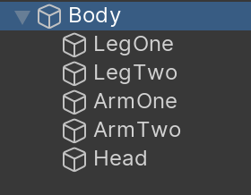
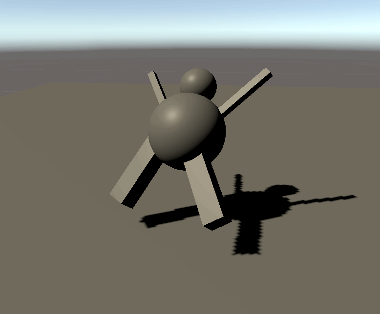

# Shapes concepts

## Using Unity Physics Authoring components

Unity Physics has six different collision shape types, and seven distinct shapes. The following table describes each one, in order of least computationally intensive to most computationally intensive. 

| Shape       | Description                                                                                                                                                                                                                                                                                                                                                                                                                                                                                                                                                               |
|-------------|---------------------------------------------------------------------------------------------------------------------------------------------------------------------------------------------------------------------------------------------------------------------------------------------------------------------------------------------------------------------------------------------------------------------------------------------------------------------------------------------------------------------------------------------------------------------------|
| Sphere      | A single point with a 3D radius. This is the simplest and least computationally intensive collision shape.                                                                                                                                                                                                                                                                                                                                                                                                                                                                |
| Capsule     | A single line with a 3D radius.                                                                                                                                                                                                                                                                                                                                                                                                                                                                                                                                           |
| Plane       | A flat plane with four sides. This is similar to a quad in graphics, but all 4 corner vertices are coplanar.                                                                                                                                                                                                                                                                                                                                                                                                                                                              |
| Box         | A 3D cube shape.                                                                                                                                                                                                                                                                                                                                                                                                                                                                                                                                                          |
| Cylinder    | A convex hull with a 3D cylindrical shape. See **Convex Hull**, below.                                                                                                                                                                                                                                                                                                                                                                                                                                                                                                    |
| Convex Hull | A 'convex hull' is as if you wrapped the object in paper, all the holes and concave parts will not be represented, just the outer most features (see the teapot example below). Collision detection algorithms for something you know is convex is much faster than concave.                                                                                                                                                                                                                                                                                              |
| Mesh        | A set of arbitrarily arranged triangles that make up the shape of the mesh. A Mesh Collider is concave by default.  This is the most complex and most computationally intensive collision shape, and collisions between two Mesh Colliders are particularly resource-heavy. It is best practice to use Mesh Colliders for kinematic (or static) objects, and convex shapes for dynamic objects. If you know that your Mesh Collider does not need to collide with another mesh, then you can make it dynamic, but you must set up your collision filtering appropriately. |

 _Example: how a convex hull looks like for a Utah teapot._

Additionally, Unity Physics supports *Compound* collider shapes. This is a combination of the above shapes that behaves as one **Physics Body**. This feature is useful in cases where an object has a complicated mesh, but the shape can be approximated using a few simpler colliders to improve performance. You can find more info about this below.

#### Optimize collisions with a bevel radius

To improve the performance and robustness of collision detection, you can configure Unity Physics to generate contacts within a small tolerance of the surface of a convex shape. This area of tolerance is referred to as a bevel radius.

To create this bevel radius, Unity Physics inflates a collider's hull to create a slightly larger outer shell, while aiming to preserve the original shape. It simultaneously inverts the collision geometry's vertices slightly, which creates rounded corners. These corners become more rounded the larger the bevel radius is, so you should aim to keep the bevel radius quite small.

 Use the **Bevel Radius** property on a collider to set up an area of tolerance. The recommended default value is 0.5.

### Compound shapes

Compound collider shapes allow you to place multiple collider shapes on one physics body. You can arrange the shapes into a hierarchy, and adjust the transform of each shape.

A single GameObject with a **Physics Body** component can contain multiple child GameObjects that have **Physics Shapes**. Unity Physics merges these into one compound ­­`PhysicsCollider` for the physics body, where the children have the collider types you specified in the Editor.

This allows you to make complex rigid bodies made of multiple simpler representations, so that the collision detection remains fast and you don't have to settle for a convex hull around the whole object.

In the following example, **Body** is a single **Physics Body** that represents a humanoid torso. The child GameObjects represent one **Physics Shape** each; four Box shapes to represent limbs and a Sphere shape to represent a head. All shapes belong to the parent Physics Body.

 _Compound shape hierarchy._

> [!NOTE]
> All the GameObjects (**Body** and children) need to be inside the **SubScene** in order to be converted.

 _The Compound shape in Play mode._
